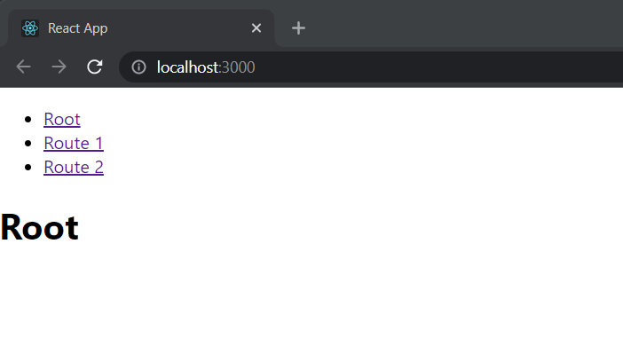
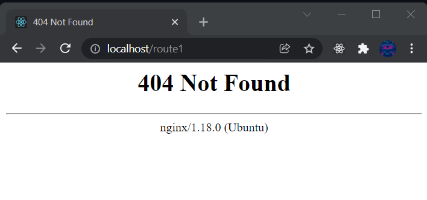

## Creating a react app

First, lets create a basic react app using [create-react-app](https://create-react-app.dev/):
```shell{promptHost: alacrity.dev}
npx create-react-app nginx-app
```

If you followed the steps to run app displayed on your CLI, you should see the following page or similar page based on the package version you used.


## Adding routes

Install [react-router](https://reactrouterdotcom.fly.dev/docs/en/v6) using:
```shell{promptHost: alacrity.dev}
npm install react-router-dom@6
```

For simplicity lets assume following is our boring `App.js`:
```jsx{20-24}
import { BrowserRouter, Link, Routes, Route } from "react-router-dom";

function App() {
  return (
    <>
      <BrowserRouter>
        <nav>
          <ul>
            <li>
              <Link to="/">Root</Link>
            </li>
            <li>
              <Link to="/route1">Route 1</Link>
            </li>
            <li>
              <Link to="/route2">Route 2</Link>
            </li>
          </ul>
        </nav>
        <Routes>
          <Route path="/" element={<h1>Root</h1>} />
          <Route path="route1" element={<h1>Route 1</h1>} />
          <Route path="route2" element={<h1>Route 2</h1>} />
        </Routes>
      </BrowserRouter>
    </>
  );
}

export default App;
```

How it looks:


## Serving a static react app using nginx

After getting our production build from `npm run build`, lets put the `build` output to `/var/www/html/` and hit `/route1/` or `/route2` endpoint directly from browser.

Since most static file servers use file based routing we are treated with 404 response. Only `/` endpoint is able to load correctly.


To fix this lets add following nginx config to `/etc/nginx/sites-available/default` and then restart nginx.
```nginx{13-17}
# default
server {
  listen 80;

  root /var/www/html;
  index index.html index.htm index.nginx-debian.html;

  # To make sure any assets can get through
  location / {
    try_files $uri @rewrites;
  }

  # If no asset matches, send it to your javascript app.
  # Hopefully it's a route in the app!
  location @rewrites {
    rewrite ^(.+)$ /index.html last;
  }
}
```

Now we are able to navigate rotues successfully. Cheers!