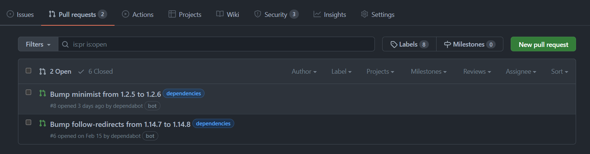
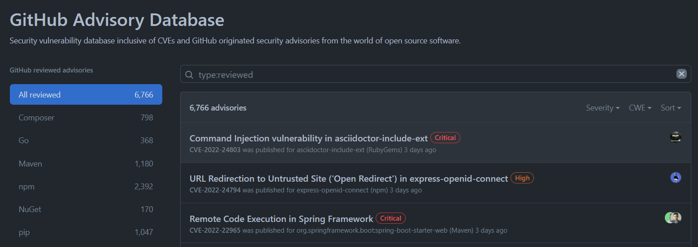
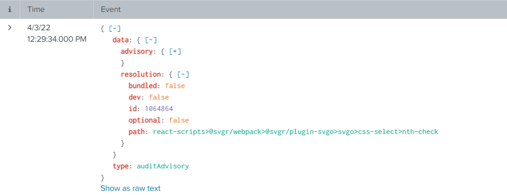
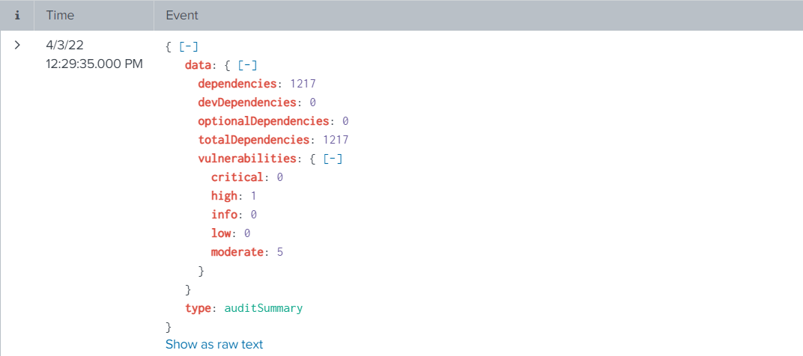
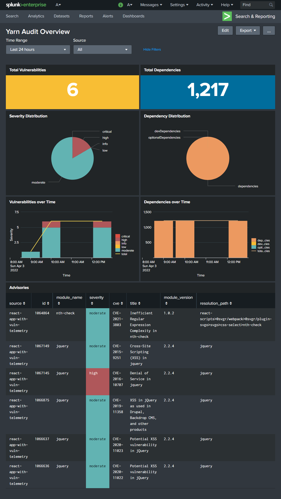

GitHub announced the general availability of security alerts on [November 2017](https://github.blog/2017-11-16-introducing-security-alerts-on-github/). These alerts are visible to repository maintainers and help identify potential vulnerable third-party libraries used in the project. You are also presented with possible remediation steps to resolve the vulnerabilities. GitHub also offers automated PRs from dependabot, although you would still need to triage some alerts time-to-time if dependabot is unable to.

You may ask how GitHub decides when to raise an alert? These alerts are consequences of advisories reported on [GitHub Advisory Database](https://github.com/advisories?query=type%3Areviewed).

## Overview
In this blog, we will be exploring how to monitor the security state of the node dependencies across multiple repositories with the help of yarn and Splunk. Let us dive right into it.

## Workflow
In a nutshell, the implementation we will look at can be presented using the following diagram.

## Collecting Security Alerts in Splunk
We will be using `yarn audit` to get the security alerts for a project. The next step is to figure out how to regularly send the data to Splunk from GitHub or when someone commits to the repository. GitHub actions to the rescue! We can use Splunk [HTTP Event Collector](https://docs.splunk.com/Documentation/Splunk/8.2.5/Data/UsetheHTTPEventCollector) to collect data at Splunk-end. For non-Splunk readers, it exposes a webhook where you can post your data on-demand, and Splunk handles the rest. You can find the source code of the GitHub action at [harsh8398/react-app-with-vuln-telemetry](https://github.com/harsh8398/react-app-with-vuln-telemetry/blob/d5e38063e46d9bfd9c93b873f15c8d38f0af2853/.github/workflows/report-yarn-audit.yml).

## Inspecting Data in Splunk
Let's inspect the received event in Splunk and identify useful information. Yarn audit returns two types of information.

1. auditAdvisory - Each record represents an alert with the third-party dependency details
   
2. auditSummary - Includes count of vulnerabilities and dependencies
   

## Representing Data in a Splunk Dashboard
Based on all the information available from the `yarn audit` output, we can quickly present it in a more digestible form using Splunk. Following is the primary example dashboard that I've built.

## TL;DR
We can use a continuous integration workflow to post security alerts data from multiple repositories to Splunk and get a single-pane view of security alerts spanning multiple GitHub repositories or even from alternative git-hosted platforms.